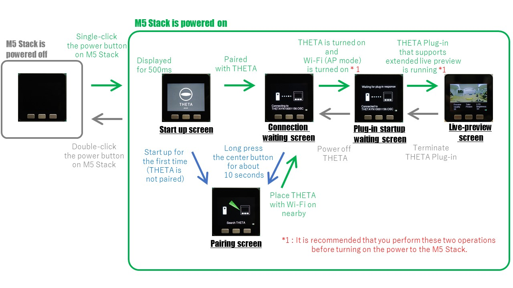
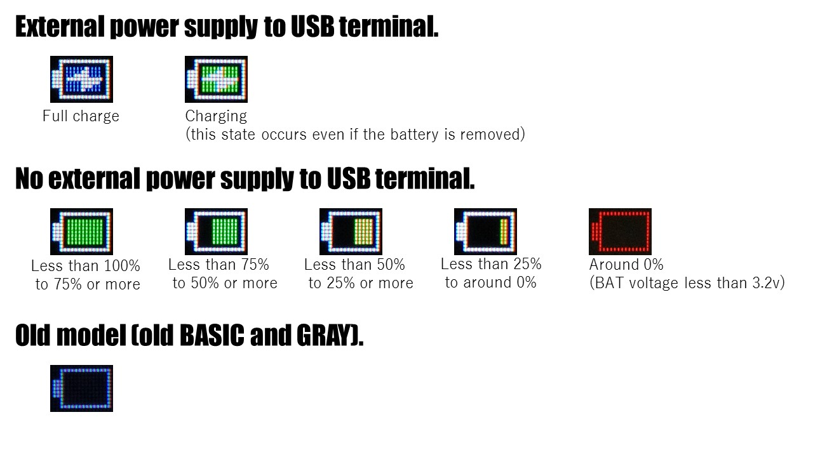

# Sample program to display RICOH THETA live-preview on M5 Stack

Japanese page [here](README_jp.md)

## Overview

A sample program that displays a live-preview at a practical frame rate on the M5 Stack by using [this THETA Plug-in](https://github.com/theta-skunkworks/theta-plugin-extendedpreview) together. 


This sample program also has the following features.

- Pairing with THETA is easy.
- If you have already paired with THETA and have activated the THETA Plug-in that supports extended live-preview, the connection will be established within a few seconds.
- With the new M5 Stack Core, the battery level is displayed.
- Left button can change the video quality (compression ratio) .
- Right button can change LCD brightness.
- Center button can be done shooting instruction to the THETA.
- Even if the shooting operation is performed on the THETA side, the state is reflected on the M5 Stack side.

## Details on THETA live-preview

### Task to solve

Live-preview output by THETA in the product state is MOTION JPEG of 640 x 320 pixels 8fps even if you choose to minimize the load on the receiving side. The data size of one frame in this case is about 46KB in most cases. Considering the Wi-Fi communication speed, CPU clock, and RAM capacity of M5 Stack (ESP32), it turns out that it is difficult to display live-preview at a practical frame rate.<br>
The specific processing contents and processing time are estimated as follows.

- Receive. (Even if you just read one frame, it takes about 100ms. It is actually a stream, so you need to keep reading data even if you can not display it. If the reception is delayed for a long time, THETA will stop the live-preview.)
- Decompress the JPEG. (It depends on the original data and compression ratio, but it takes about 200ms)
- Convert format from RGB888 to RGB565.
- Resize. (Data of 640 x 320 pixels is converted to data of 320 x 160 pixels. Although measurement was not possible, processing time on the order of tens of ms is necessary.)
- Display to TFT. (I think this also requires processing time on the order of tens of ms.)

Even if you can write M5Stack code well, it will only be displayed at 2fps. In some cases, it may be around 1 fps.
In addition, it is difficult to maintain the live preview for a long time.


### Solution

To solve this task, I used [this THETA plug-in that extended the live-preview command](https://github.com/theta-skunkworks/theta-plugin-extendedpreview). In addition, by utilizing the dual core of ESP32, the live-preview can be displayed at around 9.5fps in most cases.
(The result varies depending on the scene. In the case of slightly dark and low contrast, it is about 10 to 12 fps. In the case of complete darkness, it is about 2 to 4 fps.)

The measures implemented and their effects are as follows.

- Data can be acquired frame by frame. This measure eliminates the need for M5Stack to read streams that cannot be processed.
- When requesting one frame of data, you can specify the pixel size and compression quality of the image. This measure eliminates the need for M5Stack resizing. In addition, reception time and JPEG decompression time have been reduced. In addition, you can now have a static double buffer in RAM. Double buffering makes it possible to utilize the dual core of ESP32.
- Of the dual cores, Core1 is dedicated to communication(command transmission and response waiting by HTTPClient, data reading), and Core0 is dedicated to key input reading and display(JPEG decompression, RGB888 → RGB565 conversion and TFT output are performed by M5.Lcd.drawJpg() ). These are pipelined.


Refer to the file ["ThetaPreview.ino"](./ThetaPreview/ThetaPreview.ino) that contains the main routine of each core to understand the overall process flow. The complete source code is in ["ThetaPreview"](./ThetaPreview).

The above image is the result of measuring the processing time with an oscilloscope when the video quality is 50% (the data size of one frame is about 9KB).
Looking at this image, you may misunderstand that increasing the video quality (even increasing the data size of one frame) does not affect the frame rate because Core1 has room. In practice, JPEG decompression time is extended and the frame rate is reduced due to the effect of increasing the video quality.
In the sample program, pressing the left button allows the video quality to be switched in the order of 50%, 80%, 95%. Please check how the frame rate changes depending on the video quality.


### Further speedup

The source code released this time is written using general arduino and M5 Stack library calls.
For example, if you write the process performed by M5.Lcd.drawJpg () yourself, you may be able to speed up a little more.
Specifically, it is to perform JPEG decompression and RGB888 → RGB565 conversion at once (not analyzed. It may have already been performed), and to use DMA transfer for TFT output. <br>

As a result, if the time from JPEG decompression to TFT output is shorter than the time to acquire one frame of data, further speed-up measures may be possible.
Specifically, it is necessary to further improve the processing performed by THETA Plug-in and to output an MOTION JPEG stream with a small frame size.
However, in order to perform processing other than live-preview, you will need to write more advanced source code now.
The question remains whether it will be worth the cost of work.


## Description of operation

### State transition and operation method




If you turn on the power of the paired THETA and start the THETA Plug-in that supports extended live-preview, the live-preview will be displayed in about 5 seconds after turning on the power of the M5 Stack.


The procedure for pairing is as follows.
Simply turn on the power and Wi-Fi of THETA, whose SSID and password are in the shipping state, and place them near the M5 Stack to perform pairing. Generally, pairing can be done within 10cm.


You can shoot using either the M5 Stack or THETA.


### Battery status



Functions to check and display the battery status are created to be easily diverted. Please use it in your project.

## Recommended M5Stack type

Recommend using M5Stack BASIC or GRAY (M5 Code Ver 2018.3 or later).<br>
Old M5Stack BASIC and GRAY cannot get battery information.


The following phenomena have been confirmed with M5Stack FIRE.

- Frame rate decreases when PSRAM is enabled. The access speed of PSRAM is slower than the built-in RAM of ESP32.
- Even if PSRAM is disabled, the frame rate is slightly reduced. The processing speed of M5.Lcd.drawJpg was reduced. If you write a binary built as a normal M5 Core, the speed will be the same as BASIC.
- When power is supplied to the USB terminal with the GO BOTTOM attached to the M5 Stack FIRE, it has been confirmed that the Wi-Fi communication speed decreases. The frequency of occurrence is high when the full charge flag of charging IC(IP5306) REG_READ1 register bit3 is set, and the effect is large. Although it is infrequent, the phenomenon occurs even if this condition is not met. Removing GO BOTTOM will solve the problem. From this, it is expected that the phenomenon is caused by the competition between the IP5306 on the GO BOTTOM side and the IP5306 on the M5 Core side. Since M5 Stack FIRE and M5 GO are the same BOTTOM, the same phenomenon may occur with M5 GO.


## Notes

- Unintended sounds are caused by M5Stack hardware. The speaker amplifier picks up the communication noise of the display output. There is no solution in software.
- It is possible to increase the code to operate THETA with WebAPI by referring to this sample, but the communication overhead increases and the frame rate decreases. It seems that the frame rate is less likely to decrease if you increase the processing amount of THETA plug-in referring to [ChirpRemote source code](https://github.com/theta-skunkworks/theta-plugin-chirp-remote).


## Development Environment

### Camera

* RICOH THETA V Firmware ver.3.21.1 and above
* RICOH THETA Z1 Firmware ver.1.31.1 and above

In any case, use the [THETA Plug-in with extended live-preview](https://github.com/theta-skunkworks/theta-plugin-extendedpreview).

### M5Stack

* M5Stack BASIC (M5 Core Ver : 2017.6 \*1, 2018.3)
* M5Stack GRAY (M5 Core Ver : 2017.6 \*1, 2018.3)
* M5Stack FIRE (M5 Core Ver : 2018.2A \*2)

\* 1: If the M5 Core Ver is old, battery information cannot be obtained from the charging IC (IP5306).<br>
\* 2: The M5 Stack FIRE has three problems that have already been explained.

### Development Software
* Arduino IDE 1.8.11

### SDK/Library
* esp32 1.0.4 (Board Manager)
* M5Stack 0.2.9 (Library manager)
* AruduinoJson 6.14.1 (Library manager)


## License

```
Copyright 2018 Ricoh Company, Ltd.

Licensed under the Apache License, Version 2.0 (the "License");
you may not use this file except in compliance with the License.
You may obtain a copy of the License at

    http://www.apache.org/licenses/LICENSE-2.0

Unless required by applicable law or agreed to in writing, software
distributed under the License is distributed on an "AS IS" BASIS,
WITHOUT WARRANTIES OR CONDITIONS OF ANY KIND, either express or implied.
See the License for the specific language governing permissions and
limitations under the License.
```

## Contact


