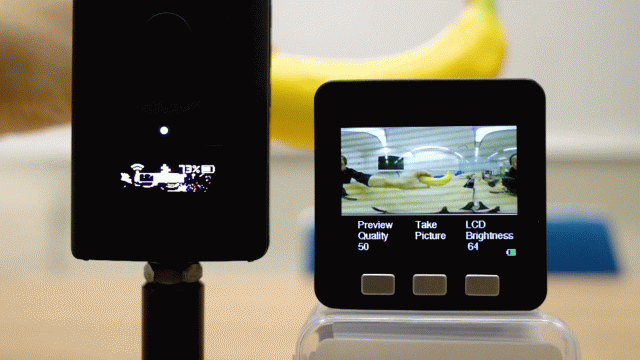
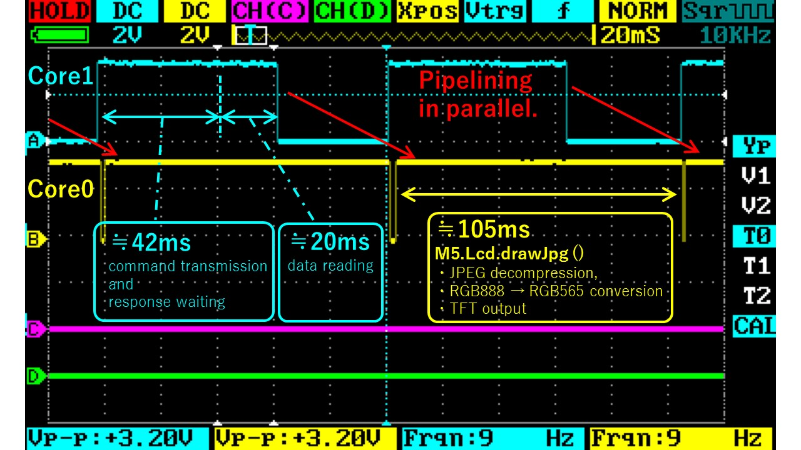
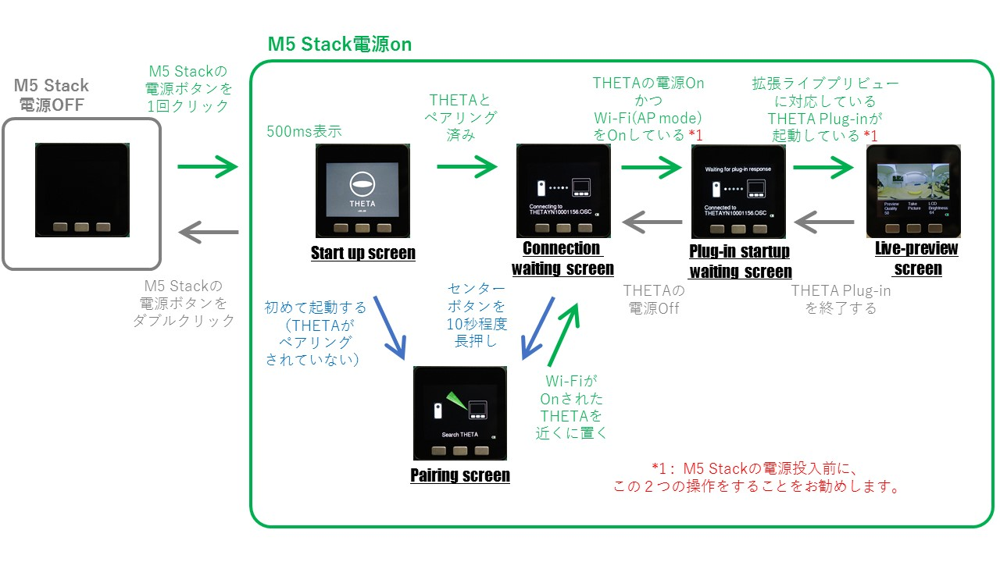
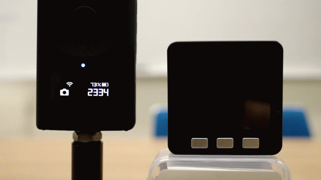
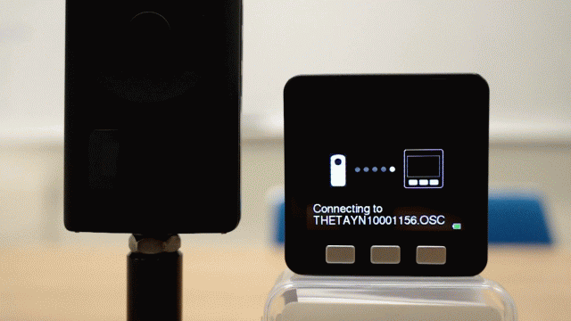
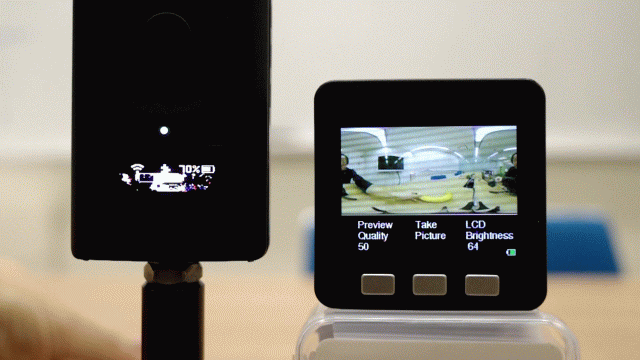
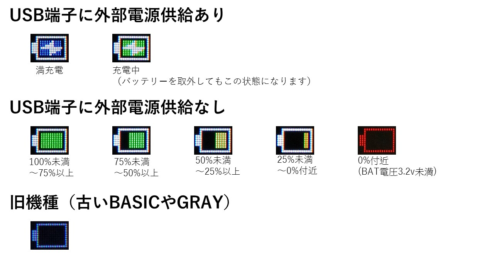
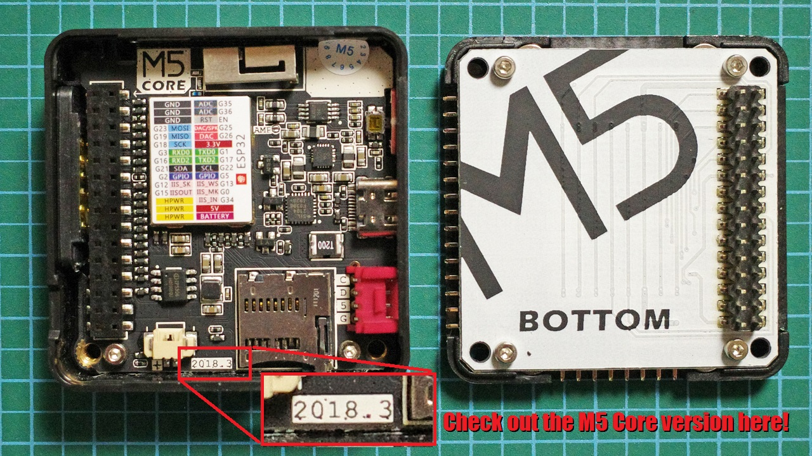

# M5 StackにRICOH THETAのライブプリビューを表示するサンプルプログラム

English page [here](README.md)

## 概要

[こちらのTHETA Plug-in](https://github.com/theta-skunkworks/theta-plugin-extendedpreview)を併用することで、M5 Stackに実用的なフレームレートでライブプリビューを表示するサンプルプログラムです。



本サンプルプログラムは、他にも以下の特徴があります。

- THETAとのペアリングが簡単です。
- THETAとペアリング済みであり、拡張ライブプリビュー対応のTHETA Plug-inが起動していれば、接続確立は数秒です。
- 新しいM5 Stack Coreを使用すると、バッテリー残量が表示されます。
- 左ボタンで映像の品質（圧縮率）を変更できます。
- 右ボタンでLCDの輝度を変更できます。
- センターボタンでTHETAに撮影指示が行えます。
- THETA側で撮影操作をしても、M5 Stack側にその状態が反映されます。


## THETAのライブプリビューに関する詳細

### 解決すべき課題

製品状態のTHETAが出力する Live-Pireview は、受信側の負荷が最も少なくなる選択をした場合でも640×320ピクセル 8fps のMOTION JPEGです。このケースでの1フレームのデータサイズは、大抵の場合 46KBくらいになります。M5 Stack(ESP32)のWi-Fi通信速度、CPUクロック、RAM容量を考慮すると、実用的なフレームレートでライブプリビューを表示することが困難であることが判ります。<br>
具体的な処理内容と処理時間を見積もると以下のようになります。

- 受信する。（1フレームを読み取るだけであっても、おおよそ100msは必要です。実際はストリームであるため、表示できないとしてもデータを読み続ける必要があります。長い期間受信が滞ると、THETAはライブプリビューを停止してしまうためです。）
- JPEGの解凍をする。（元データや圧縮率により変化しますが、おおよそ200msは必要です）
- RGB888からRGB565へのフォーマット変換をする。
- リサイズする。（640×320ピクセルのデータを320×160ピクセルのデータにします。計測できていませんが、数十msオーダーの処理時間が必要と思います。）
- TFTへの表示する。（こちらも数十msオーダーの処理時間が必要と思います。）

あなたがM5Stackのコードを上手く書けたとしても、2fps程度で表示するのがやっとでしょう。場合により1fps程度になることも考えられます。さらには、ライブビューを表示している状態を長時間維持することが困難だと思います。


### 解決方法

この課題を解決するため、ライブプリビューコマンドを拡張した[こちらのTHETAプラグイン](../)を利用しました。さらに、ESP32のデュアルコアを活用することで、大抵の場合 9.5fps程度でライブプリビューを表示できるようにしました。
（シーンにより結果が変動します。ほんのり暗くコントラストが低いケースでは10～12fps程度となります。完全な暗闇に近いケースでは、およそ2～4fps程度となります。）

実施した施策とその効果は、以下のとおりです。

- 1フレームづつデータを取得できます。この施策により、M5Stackが処理しきれないストリームを読む必要がなくなりました。
- 1フレームのデータを要求する際、画像のピクセルサイズと圧縮品質を指定できます。この施策により、M5Stack側のリサイズ処理が不要となりました。加えて、受信時間とJPEGの解凍時間が短縮できました。さらには、RAM内にStaticなダブルバッファを持つことがでるようになりました。ダブルバッファによりESP32のデュアルコアを活用できるようになりました。
- デュアルコアの、Core1は通信(HTTPClientによるコマンド送信と応答待ち、データ読み取り)に専念し、Core0はキー入力読み取りと表示（M5.Lcd.drawJpg()により、JPEG解凍, RGB888→RGB565変換, TFT出力が行われます）に専念しています。これらはパイプライン処理されています。



各コアのメインルーチンが記されているファイル["ThetaPreview.ino"](./ThetaPreview/ThetaPreview.ino)を参照すると、処理全体の流れを理解できます。ソースコード一式は[ThetaPreviewフォルダ](ThetaPreview)にあります。

上の画像は、映像品質50%（1フレームのデータサイズがおよそ9KB）であるときの処理時間を、オシロスコープで測定した結果です。
この画像を見ると、Core1に余裕があるため、映像品質を上げてても（１フレームのデータサイズを大きくしても）フレームレートに影響がないかのような誤解をするかもしれません。実際に行ってみると、映像品質を上げた影響により、JPEG解凍時間が延び、フレームレートが低下します。
サンプルプログラムでは、左ボタンを押すと、映像品質を 50%, 80%, 95%の順に切り替えられるようにしました。皆さんも、映像品質によりフレームレートが変わる様子を確認してみてください。


### さらなる高速化

今回公開したソースコードは、一般的なarduinoおよびM5 Stackのライブラリ呼び出しで書かれています。
例えば、M5.Lcd.drawJpg()で行われている処理を自身で記述することで、もう少し高速化できると思われます。
具体的には、JPEGの解凍とRGB888→RGB565変換を一括して行うこと（解析できていません。既に実施されているかもしれません）、および、TFT出力にDMA転送を利用することです。<br>

上記の結果、JPEGの解凍からTFT出力までの時間が、1フレームのデータを取得する時間より短くなった場合、さらなる高速化の施策を行えるかもしれません。
具体的には、THETA Plug-inで行う処理をさらに改善し、1フレームサイズが小さいMOTION JPEGストリームを出力するようにすることです。
ただし、ライブプリビュー以外の処理も実施するには、現在より高度なソースコードを書く必要があるでしょう。
作業コストに見合う効果が得られるか疑問が残るところです。


## 動作説明

### 状態遷移と操作方法



ペアリング済みであるTHETAの電源を入れ、拡張ライブプリビューに対応したTHETA Plug-inを起動しておけば、M5 Stackの電源投入後、約5秒でライブプリビューが表示されます。




ペアリングの操作方法は以下のとおりです。
SSIDとパスワードが出荷状態であるTHETAの電源とWi-FiをOnにし、M5 Stackの近くに置くだけでペアリングできます。おおむね、10cm以内であればペアリングできます。




M5 StackとTHETAのどちらを操作しても撮影できます。




### バッテリー状態



バッテリー状態をチェック、および、表示する関数は流用しやすいように作成してあります。是非、みなさんのプロジェクトでも使用してみてください。


## 推奨するM5Stackの種類

M5Stack BASIC or GRAY (M5 Code Ver 2018.3以降)での利用を推奨します。<br>
古い M5Stack BASICやGRAYではバッテリー情報を取得できません。



また、M5Stack FIREでは、以下の現象が確認されています。

- PSRAMを有効にするとフレームレートが低下します。PSRAMのアクセス速度はESP32内蔵のRAMより遅いためです。
- PSRAMを無効としても僅かにフレームレートが低下します。M5.Lcd.drawJpgの処理速度低下がみられました。通常のM5 Coreとしてビルドしたバイナリを書き込むとBASICと同等の速度となります。
- M5 Stack FIREにGO BOTTOMを取り付けた状態でUSB端子に給電してていると、Wi-Fiの通信速度が低下する現象が確認されています。充電IC(IP5306) REG_READ1レジスタ bit3の満充電フラグが立っているときに発生頻度が高く、影響が大きいです。低頻度ですが、この条件を満たさなくても現象が発生します。GO BOTTOMを外すと問題が解消されます。このことから、GO BOTTOM側IP5306とM5 Core側IP5306の競合による現象と予想されます。M5 Stack FIREとM5 GOは、同じBOTTOMであるため、M5 GOでも同様の現象がでる可能性があります。


## 注意事項

- 意図しない音が鳴るのはM5Stackのハードウェアが原因です。ディスプレイ出力の通信ノイズをスピーカーのアンプが拾ってしまいます。ソフトウェアで解決する方法はありません。
- 本サンプルを参考にWebAPIでTHETAを操るコードを増やすことも可能ですが、通信オーバヘッドが嵩みフレームレートが落ちます。[ChirpRemoteのソースコード](https://github.com/theta-skunkworks/theta-plugin-chirp-remote)を参考にTHETAプラグインの処理量を増やしたほうがフレームレートが低下しにくいと思われます。


## 開発環境

### Camera

* RICOH THETA V Firmware ver.3.21.1 and above
* RICOH THETA Z1 Firmware ver.1.31.1 and above

いずれについも、[ライブプリビューが拡張されたTHETA Plug-in](../)を併用すること。

### M5Stack

* M5Stack BASIC (M5 Core Ver : 2017.6 \*1, 2018.3)
* M5Stack GRAY (M5 Core Ver : 2017.6 \*1)
* M5Stack FIRE (M5 Core Ver : 2018.2A \*2)

\*1:M5 Core Verが古いと充電IC(IP5306)からバッテリー情報を取得できません。<br>
\*2:M5 Stack FIREには、説明済みの問題が3点あります。

### Development Software
* Arduino IDE 1.8.11

### SDK/Library
* esp32 1.0.4 (Board Manager)
* M5Stack 0.2.9 (Library manager)
* AruduinoJson 6.14.1 (Library manager)


## ライセンス

```
Copyright 2018 Ricoh Company, Ltd.

Licensed under the Apache License, Version 2.0 (the "License");
you may not use this file except in compliance with the License.
You may obtain a copy of the License at

    http://www.apache.org/licenses/LICENSE-2.0

Unless required by applicable law or agreed to in writing, software
distributed under the License is distributed on an "AS IS" BASIS,
WITHOUT WARRANTIES OR CONDITIONS OF ANY KIND, either express or implied.
See the License for the specific language governing permissions and
limitations under the License.
```

## Contact


