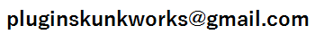

# Extended Live-Preview THETA Plug-in Sample

より詳しい日本語の説明は[こちら](https://qiita.com/KA-2/items/公開後にリンクを更新します)。<br>
[Click here](https://qiita.com/KA-2/items/公開後にリンクを更新します) for a more detailed explanation in Japanese.

## Overview

It is a sample program that is the basis when performing image processing for live-preview with THETA plug-in.
This example is useful when executing frame image processing in THETA and checking the result on WebUI.
Customize the image processing part and WebUI part according to each person's purpose.

This sample program is designed to accept WebAPI ([RICOH THETA API v2.1](https://api.ricoh/docs/theta-web-api-v2.1/)) from the port for THETA Plug-in WebUI. In addition, the live-preview command has been extended (customized) to display the live-preview on the WebUI.

The usage of extended commands and examples of applications are described below.


## Connection

The IP address is the same as when not launching the plugin.
It depends on the WLAN mode of THETA as follows.

|WLAN mode of THETA|IP address|
|---|---|
|AP mode|192.168.1.1|
|CL mode|IP address assigned to THETA by router|

The port number is 8888


## Extended command description

### Protocols

This plug-in can handle the same commands as [RICOH THETA API v2.1](https://api.ricoh/docs/theta-web-api-v2.1/) via the WebUI port (8888). However, RICOH THETA API v2.1 [camera.getLivePreview](https://api.ricoh/docs/theta-web-api-v2.1/commands/camera.get_live_preview/) is disabled command.

The following extended commands can be used instead of the above disabled commands.
The extended command can be used by performing "POST" to the following URL.

In the case of AP mode:

	http://192.168.1.1:8888/preview/commands/execute


### Commands

List of extended commands

|No|Command Name|
|---|---|
|1|camera.getPreviewStat|
|2|camera.startPreview|
|3|camera.stopPreview|
|4|camera.getPreviewFrame|

<details><summary><b>Extended command details (click to open !!!)</b></summary><div>

<br>

### camera.getPreviewStat

#### Overview

Returns the live-preview acquisition status inside the THETA plug-in.

#### Parameters

None.

#### Results

|Name|Type|Description|
|---|---|---|
|results|String|"on" or "off"|

<br>

### camera.startPreview

#### Overview

Start live-preview acquisition inside THETA plug-in.

#### Parameters

|Name|Type|Description|
|---|---|---|
|formatNo|Integer|1:640 x 320 pixels 8fps, <br>2:640 x 320 pixels 30fps, <br>3:1024 x 512 pixels 8fps, <br>4:1024 x 512 pixels 30fps, <br>5:1920 x 960 pixels 8fps<br>Optional. If omitted 4.|

#### Results

None.

<br>

### camera.stopPreview

#### Overview

Stop live-preview acquisition inside THETA plug-in.

#### Parameters

None.

#### Results

None.

<br>

### camera.getPreviewFrame

#### Overview

Get the latest one frame of live-preview.

#### Parameters

|Name|Type|Description|
|---|---|---|
|resizeWidth|Integer|Do not resize : 0<br>Minimum value (minwidth): 2<br>Maximum value (maxwidth): same as createScaledBitmap ()<br>Optional. If omitted, same as do not resize.|
|quality|Integer|Minimum value (minquality): 0<br>Maximum value (maxquality): 100<br>Optiona. If omitted, 100.|

#### Results

Binary data of live view 1 frame (JPEG).
Binary data is transferred as Content-Type:image/jpeg.

</br>
</br>

</div></details>


## Button operation and Status display

### Button operation

Short press the Mode button to switch the live-preview acquisition state (on/off) inside the plug-in. Turning this OFF will help THETA to save power and reduce heat generation.


### Status display

This sample program does not operate the THETA V LED and displays a live-preview on THETA Z1 OLED.
The display of the THETA Z1 OLED display changes in the order of "normal display", "edge display", and "difference between frames" each time the WLAN button is pressed.


This corresponds to the part of the source code below that is abbreviated as "**** OLED display sample code ****".<br>
Please delete or rewrite this part according to your own purpose.

[app/src/main/java/com/theta360/extendedpreview/MainActivity.java](app/src/main/java/com/theta360/extendedpreview/MainActivity.java#L344-418)

```:MainActivity.java
    //==============================================================
    // OLED Thread
    //==============================================================
    public void drawOledThread() {
        new Thread(new Runnable() {
            @Override
            public void run() {
                int outFps=0;
                long startTime = System.currentTimeMillis();
                Bitmap beforeBmp = null;

                while (mFinished == false) {

                    byte[] jpegFrame = latestLvFrame;
                    if ( jpegFrame != null ) {

                       **** OLED display sample code ****

                    }
                }
            }
        }).start();
    }
```


## WebUI

A live-preview can be displayed on the WebUI to perform exposure compensation and shooting.
By modifying the HTML files and javascript under [assets](app/src/main/assets), you can remotely control THETA with more commands.


When THETA is set to CL mode and connected to the local network
Live-previews can be obtained simultaneously from multiple devices on the same network.


This type of usage places a heavy load on THETA, but you can reduce the load by adjusting the frequency of frame updates from the browser.
The following is the relevant part of the source code. Currently, the code attempts to update the frame at intervals of about 30 ms.

[app/src/main/assets/js/preview.js](app/src/main/assets/js/preview.js#L79-90)

```:preview.js
function repeat() {
  const d1 = new Date();
  while (true) {
    const d2 = new Date();
    if (d2 - d1 > 30) {
      break;
    }
  }
  updatePreviwFrame();
  updatePreviewStat();
  updateEv();
}
```


## Example of using extended commands in M5 Stack

Live-previews can be displayed on any device that can perform HTTP communication, not just browsers.

The following is an example of displaying the live-preview on [M5 Stack](https://m5stack.com/).<br>
See [M5Stack_Sample](M5Stack_Sample) for details.


## Development Environment

### Camera
* RICOH THETA V Firmware ver.3.21.1 and above
* RICOH THETA Z1 Firmware ver.1.31.1 and above

### SDK/Library
* RICOH THETA Plug-in SDK ver.2.0.10

### Development Software
* Android Studio ver.3.5.3
* gradle ver.5.1.1


## License

```
Copyright 2018 Ricoh Company, Ltd.

Licensed under the Apache License, Version 2.0 (the "License");
you may not use this file except in compliance with the License.
You may obtain a copy of the License at

    http://www.apache.org/licenses/LICENSE-2.0

Unless required by applicable law or agreed to in writing, software
distributed under the License is distributed on an "AS IS" BASIS,
WITHOUT WARRANTIES OR CONDITIONS OF ANY KIND, either express or implied.
See the License for the specific language governing permissions and
limitations under the License.
```

## Contact


